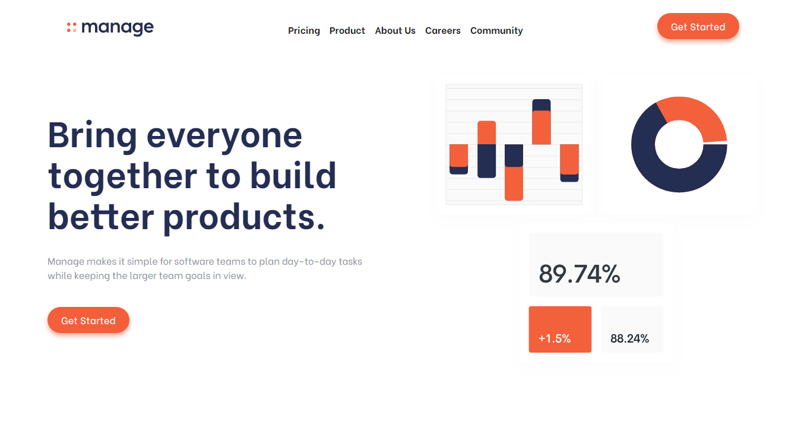

# Frontend Mentor - Manage landing page solution

This is a solution to the [Manage landing page challenge on Frontend Mentor](https://www.frontendmentor.io/challenges/manage-landing-page-SLXqC6P5). Frontend Mentor challenges help you improve your coding skills by building realistic projects.

## Table of contents

- [Overview](#overview)
  - [The challenge](#the-challenge)
  - [Screenshot](#screenshot)
  - [Links](#links)
- [My process](#my-process)

  - [Built with](#built-with)
  - [Continued development](#continued-development)
  - [Useful resources](#useful-resources)

- [Author](#author)

## Overview

**This challenge is build with Dart SASS Version 1.44.0 to use new features of SASS @forward and @use rules**

### The challenge

Users should be able to:

- View the optimal layout for the site depending on their device's screen size
- See hover states for all interactive elements on the page
- See all testimonials in a horizontal slider
- Receive an error message when the newsletter sign up `form` is submitted if:
  - The `input` field is empty
  - The email address is not formatted correctly

### Screenshot

### Links

- Solution URL: [Add solution URL here](https://your-solution-url.com)
- Live Site URL: [Manage Landing Page](https://aroyan.github.io/manage-landing/)

## My process

### Built with

- Semantic HTML5 markup
- Dart SASS Version 1.44.0
- Flexbox
- CSS Grid
- Mobile-first workflow

### Continued development

I'm going to update the carousel section to get identical as desgin preview soon

### Useful resources

- [How to create slideshow](https://www.w3schools.com/howto/howto_js_slideshow.asp) - This helped me for making carousel/ slideshow. I really liked this pattern and will use it going forward.
- [How to create Hamburger menu](https://www.w3schools.com/howto/howto_js_mobile_navbar.asp) - This is an amazing article which helped me finally understand how to create functional hamburger menu. I'd recommend it to anyone still learning this concept.

## Author

- Website - [Aroyan Bakti](https://www.aroyanbakti.com)
- Frontend Mentor - [@aroyan](https://www.frontendmentor.io/profile/aroyan)
- Twitter - [@aroyanbaktis](https://www.twitter.com/aroyanbaktis)
